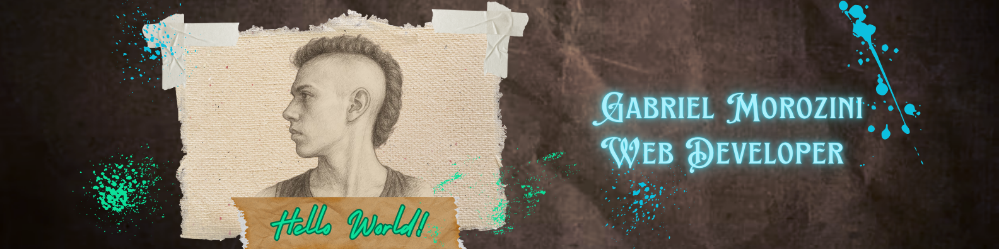

  
  
  

<h3 align="center">Tornando-me um engenheiro de software, analista de sistema, gestor de banco de dados </h3>

📖 Estudando/Aprendendo: Python, phpMyAdmin, C, Flutter, Dart, html, css e javascript 
💬 Me pergunte sobre: Qualquer dúvida relacionada código 
📂 Precisa de algum projeto? envie para g3hunterbugs@gmail.com a sua proposta

## 🌐 Socials:
 

# 💻 Skills:
          

# 📊 GitHub Stats:
 

### ✍️ Remember

---

<!-- Proudly created with GPRM ( https://gprm.itsvg.in ) -->
