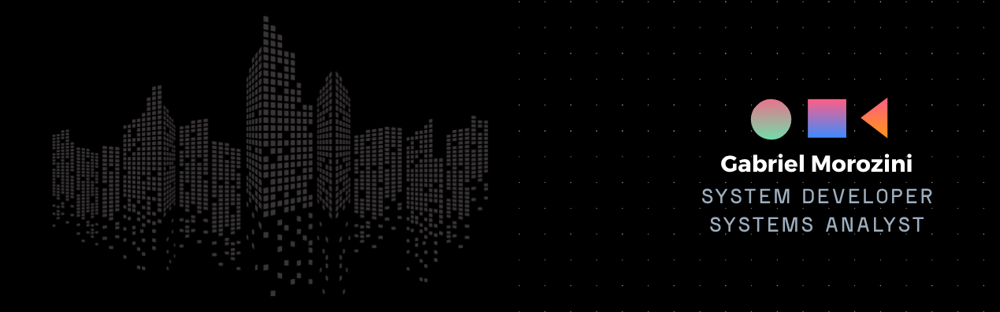

  

###

  
  

###

<h1 align="center">Hello World! 👋🌍</h1>

###

[Typing SVG](https://readme-typing-svg.demolab.com?font=Bitcount&weight=300&size=19&duration=3000&pause=3000&width=435&lines=Hello+World!;I'm+Gabriel+Morozini.;But+you+can+call+me+G3+or+Morozini...;Contact+me+if+you+want!)

###

- 🔭 I'm doing some personal projects to strengthen my experience, but I'm also looking for job opportunities.  - 📚 I'm currently studying C++, Python and React and I'm doing some projects and challenges in my day to day life.  - 📠Contact me and let's do some project together! ;)

###

<h3 align="left">🛠 Language and tools</h3>

###

  
  
  
  
  
  
  
  
  
  
  
  
  
  
  
  
  
  
  
  
  
  
  

###
